# Сканер российских вин «Своё Вино»

Решение кейса ЛЦТ‑2026 №10 (Россельхозбанк). Покупатель у полки фотографирует бутылку — сервис
находит **одну** карточку вина в каталоге платформы «Своё Вино» (2 103 позиции) и показывает её
на мобильной странице в стиле портала: вкус, к чему подать, похожие вина других виноделен и
вопросы сомелье. Вина нет в каталоге — не тупик: аналоги вместо пустого экрана.

**Материалы:** видео работы без склеек и презентация — по ссылкам в форме сдачи ·
устройство сервиса — [`ARCHITECTURE.md`](ARCHITECTURE.md) · договоры API —
[`docs/`](docs/api-after-search.md) · отчёт о прогоне —
[`research/2026-09-27_results/RESULTS.md`](research/2026-09-27_results/RESULTS.md).

## Результаты на публичных данных

Неизменённый скрипт организатора `participant_test.sh` против этой сборки на RTX 3080 10 ГБ,
27.09.2026. Набор — 100 «Реальных фото» организатора; вино каталога — у 65 из них,
35 — вина вне выгрузки (приватный тест, по словам организатора, — только вина каталога). У двух
из 65 (R048, R084) эталон — карточка живого портала, которой нет в выгрузке 07.09: верный ответ по
индексу невозможен, но в таблице они считаются промахами.

| 65 реальных фото с вином из каталога | top-1 (= F1@1) | top-5 (= F1@5) |
|---|---|---|
| «то же вино» — засчитан другой год урожая или дубль карточки | **95,4 %** [89,5–100] | **96,9 %** |
| строго по slug эталона | 89,2 % [80,3–96,9] | 95,4 % |

- **F1.** F1@k = 2·P·R/(P+R); сервис отвечает всегда (null — 0), поэтому P = R и F1@k равна доле
  попаданий в top-k. В каждом ответе API есть и уверенность по кадру — `confidence.top1`,
  `confidence.top5` и отрыв 1-го от 2-го `margin` (так мы читаем «метрику уверенности (F1) для
  топ-1 и топ-5» из ТЗ). Отрыв ≥ 0,5 у 59 из 65 ответов — и все 59 верны; но и на винах вне
  выгрузки отрыв ≥ 0,5 у 18 из 35: вино вне каталога большой отрыв не выдаёт.
- **63 кадра с вином из выгрузки 07.09:** «то же вино» 62 из 63 = 98,4 % [94,9–100], строго 58 из
  63 = 92,1 %.
- **Время ответа:** p50 1,22 с, p95 1,50 с, максимум 1,84 с; дольше 3 с — ни одного из 100.
- **Стабильность:** повторный прогон дал те же ответы на 100 из 100 кадров.
- **Условия съёмки:** полка 20 из 20, в руке 16 из 17, дегустация 17 из 17, стол 8 из 10; вина
  виноделен с 6 и больше позициями в каталоге (серии двойников) — 60 из 61, строго 56 из 61
  (строгие промахи — соседний год урожая или дубль карточки).
- **Честно о проверке.** Разметка кадров наша (`data/gt/real_photos_gt.tsv`). Ранкер частично
  учился на JPEG-копиях этих снимков; вне фолда — 61 из 65. Отдельная оценка — тест kr-test,
  отложенный до обучения адаптера и ранкера: **94,5 %** [91,7–97,0] против 89,6 % у прежнего пути,
  p = 0,0015 (розничные пакшоты одного магазина; разность честная, уровни оптимистичны: правила
  Э1–Э7 проверялись на всём krasnostop, включая эти кадры, — ARCHITECTURE §7). Из 3 публичных кадров `eval/` вино в выгрузке
  есть только у одного — он верен.

## Как это выглядит

| | | | |
|---|---|---|---|
| 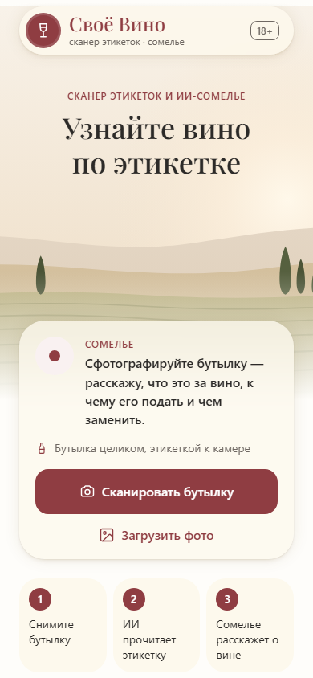 | 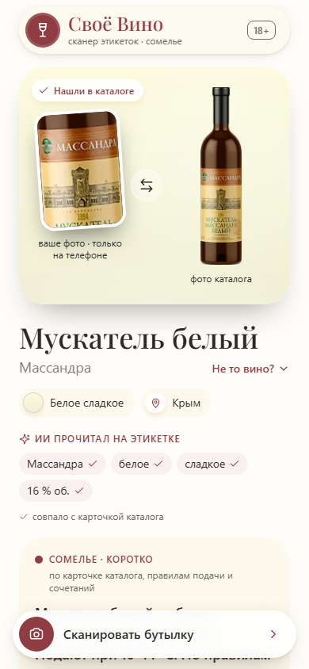 | 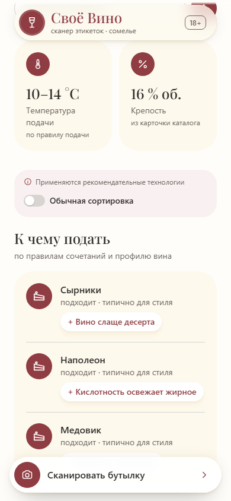 | 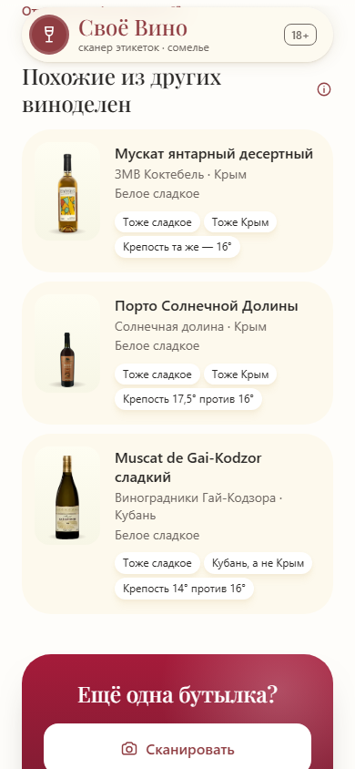 |
| снимок с камеры или фото из галереи | одна карточка и что прочитано на этикетке | подача и блюда по правилам сочетаний | похожие вина других виноделен |
| 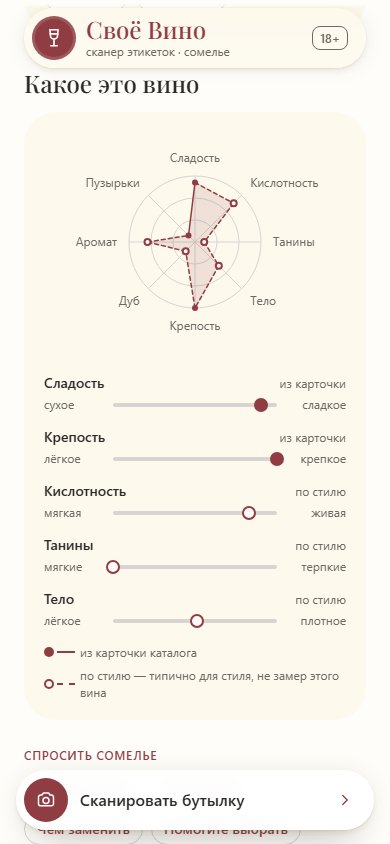 | 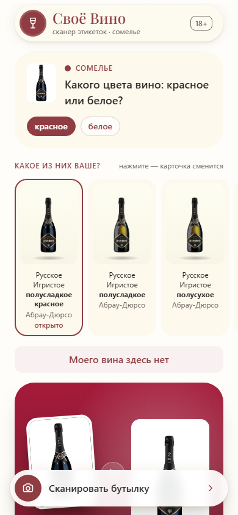 | 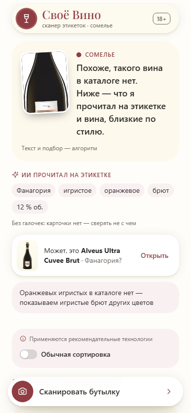 | 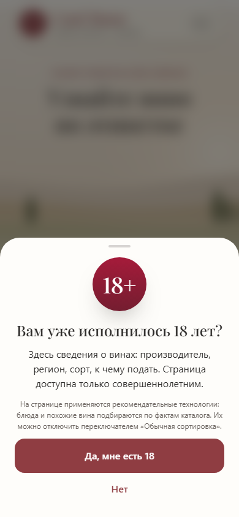 |
| профиль вкуса по 8 осям | спорный кадр: вопрос, который различает двойников | вина нет в каталоге: аналоги вместо тупика | 18+ до любого контента |
| 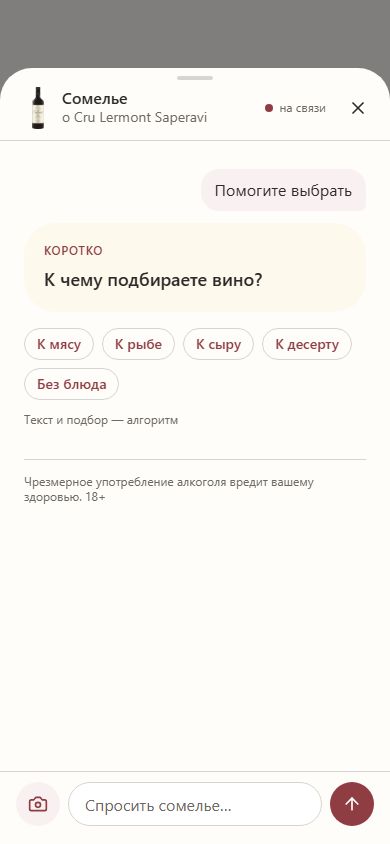 | 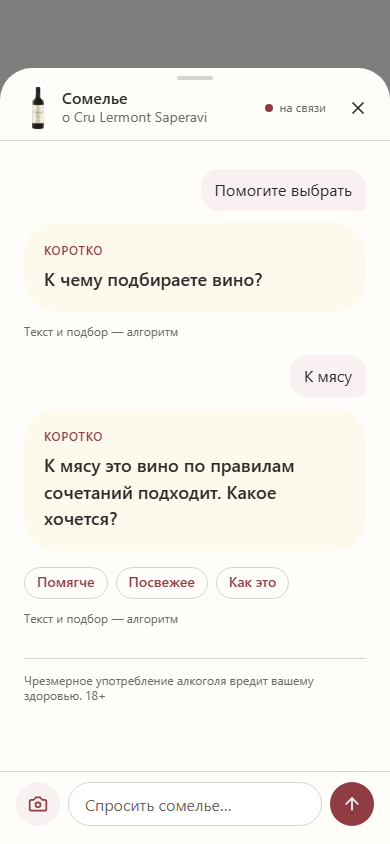 | 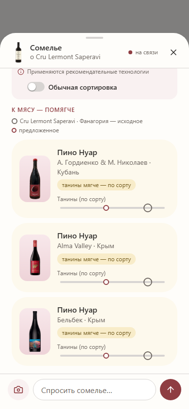 | 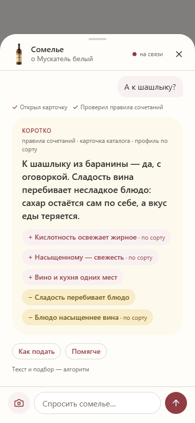 |
| сомелье спрашивает, к чему подбираете вино | …и какое хочется | три вина других виноделен с причинами | ответ к блюду: плюсы и минусы по правилам |

Фото бутылок на снимках — из выгрузки организатора; в репозиторий они не входят
([`data/README.md`](data/README.md)).

## Без облака и больших LLM

- **Две открытые модели, обе локально:** SigLIP 2 so400m ищет по картинке, `qwen3.5:4b` (3,4 ГБ,
  в Ollama) читает этикетку. Облачных API и больших моделей по подписке нет.
- **Одна игровая видеокарта:** RTX 3080 10 ГБ; сервис с моделью чтения занимает около 7,2 ГБ
  видеопамяти (`research/2026-09-23_audit/clean_latency/`).
- **Ни одного внешнего вызова:** фото и вопросы не уходят с машины, платы за запросы нет,
  сервис работает без интернета. Ответ сомелье считают правила и справочники; модель только
  пересказывает готовые факты, и её текст проверяется.
- **Запуск — Docker compose**, шаги — [«Шаги на чистой машине»](#шаги-на-чистой-машине). Без
  видеокарты сервис поднимается на процессоре, но кадр идёт десятки секунд и в 10 с скрипта не
  укладывается: оценка и демо — на видеокарте.

**Что взято готовым, а что обучено нами.** Готовые модели работают как есть, а поверх них мы
обучили свои компоненты на размеченных нами кадрах, внутри контура:

| Компонент | Что делает | Откуда и как обучен |
|---|---|---|
| SigLIP 2 so400m (`google/siglip2-so400m-patch14-384`, ревизия `e8e48729`) | векторы фото бутылки | открытая модель, веса заморожены |
| `qwen3.5:4b` в Ollama | читает этикетку: винодельня, сорт, год, сахар, цвет | открытая модель, не дообучалась: задан только промпт |
| индекс каталога `data/index/visual-s2so400m.npz` | 6 312 векторов эталонов 2 103 карточек | наш: собран из фото выгрузки организатора (у 10 карточек эталон поправлен, [`data/README.md`](data/README.md)) |
| адаптер поиска `data/index/cv-adapter-lw.npz` | линейная карта 1152 × 1152 поверх векторов SigLIP: гасит свет, фон, ракурс и телефон | наш: обучен на 6 116 парах «окно кадра — эталон верной карточки» из 1 529 кадров, CPU, около 50 с |
| ранкер `configs/resolve/s2so400m-vlm35-lw-pool.json` | выбирает одну карточку из top-20 по 34 признакам картинки и прочитанного текста | наш: обучен на 1 517 кадрах (30 266 пар), CPU, около 12 мин |

Адаптер и ранкер вместе подняли «то же вино» на отложенном тесте kr-test с 89,6 до 94,5 %
(p = 0,0015, [ARCHITECTURE §7](ARCHITECTURE.md)). Как пересобрать данные и переобучить —
[«Подготовка данных и обучение»](#подготовка-данных-и-обучение).

## Соответствие ТЗ

| Пункт ТЗ | Статус | Где |
|---|---|---|
| Загрузка фото с камеры и из галереи | есть | страница `/`, `app/api/static/index.html` |
| Анализ изображения (CV) и поиск в каталоге | есть | SigLIP 2 + адаптер поиска, [ARCHITECTURE §2](ARCHITECTURE.md#2-пайплайн-и-границы-слоёв) |
| Карточка в JSON, уверенность top-1 и top-5, отрыв | есть | `POST /v1/scan`, `POST /v1/eval/predict`: `confidence`, `margin`, `top5` ([«Контракт»](#контракт)) |
| Мобильная страница карточки и функция после поиска | есть | [«После поиска и сомелье»](#после-поиска-и-сомелье), `docs/` |
| Вина нет в каталоге → похожие, аналоги других виноделен | есть, частично автоматически | подсказка «может не быть в каталоге» ловит 58 % таких кадров при 2 % ложных; кнопка «Моего вина здесь нет» → вина винодельни и аналоги |
| Скрипт организатора: `{"slug"}` на каждый кадр | есть | всегда HTTP 200, null — 0; `scripts/run_eval.sh` |
| Точность 90–100 %, ощутимый отрыв 1-го от 2-го | 95,4 % «то же вино», строго 89,2 % | [«Результаты»](#результаты-на-публичных-данных) |
| SLA до 3 с | p95 1,5 с | там же |
| Карточка: производитель, регион, сорт, описание, к чему подать | есть | описание — из выгрузки организатора, подача — по правилам сочетаний |
| Карточка: рейтинг Роскачества | нет | его нет ни в выгрузке организатора, ни на карточке портала; поле появится, если данные передадут |
| README и ARCHITECTURE, воспроизводимый запуск | есть | этот файл, `ARCHITECTURE.md`, Docker compose; Ubuntu / Debian — [«Подготовка Ubuntu и Debian»](#подготовка-ubuntu-и-debian); обучение — [«Подготовка данных и обучение»](#подготовка-данных-и-обучение) |

**Почему к сервису возвращаются.** Скан не заканчивается тупиком: у каждого исхода есть
следующий шаг — карточка, «Не то вино?», аналоги, «Моего вина здесь нет». После карточки —
вопросы сомелье («К чему подбираете вино?» → «Какое хочется?» → три вина), «Чем заменить» и
«Ещё одна бутылка?», а ссылка ведёт на карточку вина на портале. Продуктовой аналитики в версии 1
нет — сервис ничего не пишет (152-ФЗ); для пилота предлагаем меры: доля сканов со вторым
действием, сканов на сессию, доля тупиков, возврат за 7 дней.

**Каталог** — выгрузка организатора от 07.09 (`strapi_output0709.csv`, 2 103 карточки). Вин,
которые появились на портале позже, в индексе нет.

## Требования

- Python 3.12 (менеджер окружения — [uv](https://docs.astral.sh/uv/))
- NVIDIA GPU с CUDA 12.8+ и 10 ГБ видеопамяти (на RTX 3080 10 ГБ во время прогона занято 7,2 ГБ
  вместе с рабочим столом; карты меньше 10 ГБ не проверялись). Без видеокарты ответ дольше 10 с
  скрипта организатора (раздел «Без видеокарты»)
- Для Docker: Linux — Ubuntu 24.04 проверена; Debian 12 — с Docker из репозитория Docker, на нём не
  запускали ([«Подготовка Ubuntu и Debian»](#подготовка-ubuntu-и-debian)) — или Windows с Docker
  Desktop и WSL 2; Docker Compose 2.20+ и buildx; на диске — около 25 ГБ (образ `gpu` с весами SigLIP, образ
  Ollama, модель чтения 3,4 ГБ, кэш сборки)

## Окружение

```bash
uv sync --extra gpu --extra dev --extra api --extra cv   # + --extra ocr для EasyOCR и RapidOCR
```

## Тесты

```bash
uv run pytest                            # только CPU, без моделей и Ollama
SVS_RUN_GPU_TESTS=1 uv run pytest        # плюс тесты, которым нужны веса или видеокарта
```

`tests/conftest.py` ставит `CUDA_VISIBLE_DEVICES=-1`, если `SVS_RUN_GPU_TESTS` не равен `1`.

## Сервис

`python -m app.api` поднимает HTTP-сервис для скрипта оценки организатора и для интерфейса.
Итог на публичных данных — в [«Результатах»](#результаты-на-публичных-данных); история ранних
замеров цепочки (модель `s2so400m-vlm35.json`, с нынешним кодом не загружается) — в
[`configs/resolve/README.md`](configs/resolve/README.md).

**Путь поиска и выбора по умолчанию (с 26.09)** — кандидат 2 фундаментального трека
`adapter-lw-ranker` ([`research/2026-09-26_fund/`](research/2026-09-26_fund/FINAL_REPORT.md)):
- векторы SigLIP проходят обученный адаптер поиска — линейное выбеливание, карта
  `data/index/cv-adapter-lw.npz`, собранная под индекс `ccd3a01f`;
- модель resolve — `s2so400m-vlm35-lw-pool.json`: рецепт `-goal`, переобученный на 1 517 кадрах
  пула по выдаче адаптера.

Он принят по тесту, замороженному до работы (kr-test — 309 снимков карточек товаров интернет-магазина krasnostop.ru с винами каталога (розничные пакшоты, не фото у полки; сами снимки в репозиторий не входят), открыт один раз
на кандидата): «то же вино» **94,5 % [91,7–97,0]** против 89,6 % у прежнего пути, починки 18,
поломки 3, p = 0,0015. На 65 реальных фото организатора выигрыша нет: 62 из 65 против 63
(ARCHITECTURE, §7).

**Прежний путь** — `SVS_CANDIDATE=off` (или `none`): поиск без адаптера и `s2so400m-vlm35-goal.json`
(iter 20 цикла улучшений; счёты CV `per_slug=zmax`, признаки `resolve-features/3`), бит в
бит как до 26.09. На dev out-of-fold `-goal` даёт 89,3 / 79,2 % против 86,6 / 78,5 % у
`s2so400m-vlm35-m2.json` и 85,2 / 78,5 % у модели замера (с нынешним кодом не загружается).

```
байты → decode (серый фон для CV, белый для чтения) → виды bench.retrieval --target none
      → SigLIP 2 so400m → адаптер поиска cv-adapter-lw.npz (SVS_CANDIDATE=off — без него)
      → top-20 по индексу visual-s2so400m.npz, per_slug=zmax
      → qwen3.5:4b по целому кадру 1024 px, бюджет min(5 000 мс, остаток)
      → обученный resolve s2so400m-vlm35-lw-pool.json (при off — -goal.json)
      → slug и калиброванная вероятность top-1
      → при p(top-1) < 0,5 разбор спорного кадра: без бонуса соседу по кластеру,
        без кандидатов, спорящих с прочитанными сахаром и цветом (app/resolve/ambiguous.py)
```

Разбор спорного кадра включается только при низкой уверенности и параметров не имеет. Правило
найдено на общем полевом датасете (полевой набор `field_dataset`, в репозиторий не входит), и числа на нём — 84,8 → 90,5 % на
оригинальных телефонных снимках, 81,6 → 86,0 % на искажениях — посчитаны на тех же кадрах, по
которым его искали: это не оценка. Отдельной оценки у правила нет: оно одинаково стоит в обоих
путях, сравнённых на kr-test (ARCHITECTURE, §7). Ответ живого сервиса совпадает с офлайн-расчётом
на всех 353 кадрах v2 (GPU-окно E, `research/2026-09-26_fund/ship/live_E/result.txt`).

Параметры замера (кроп и размер для VLM, float32 и `per_slug=zmax` для CV — максимум по
косинусам, выровненным по парам «окно запроса × вид эталона», `app.features.index.align_pairs`)
— константы `app/api/config.py`, настройкой они не меняются. Файлы сервиса — в `app/api/`:
`config.py` (настройки), `service.py` (сборка, прогрев, скан), `cards.py` (карточки каталога),
`after.py` и `after_layer.py` (слой после поиска: маршруты и логика), `somm.py` (маршруты
сомелье), `page.py` (страница продукта на `/`, лист сомелье `static/somm.js` и `somm.css`),
`field.py` (полевой контур на `/field`), `main.py` (FastAPI). Логика без FastAPI — в
`app/recommend/` (справочник, похожие, «Сомелье у полки», профиль вкуса, данные сомелье) и
`app/sommelier/` (ворота видеокарты, маршрут и барьер, ответы, голос и его проверки).

### Запуск

```bash
uv sync --extra gpu --extra ocr --extra cv --extra api
ollama pull qwen3.5:4b
export SVS_DATASET_DIR=".../Датасет и подробное задание/unpacked/Датасет"   # описания и eval/
# веса SigLIP ровно той ревизии, по которой собран индекс; сервис их не качает (local_files_only)
uv run python -c "from huggingface_hub import snapshot_download; snapshot_download('google/siglip2-so400m-patch14-384', revision='e8e487298228002f3d8a82e0cd5c8ea9c567f57f', allow_patterns=['config.json', 'preprocessor_config.json', 'model.safetensors'])"
# сервис берёт из кэша ветку main — как в Dockerfile, указать её на ревизию индекса
H=~/.cache/huggingface/hub/models--google--siglip2-so400m-patch14-384; mkdir -p "$H/refs"
printf e8e487298228002f3d8a82e0cd5c8ea9c567f57f > "$H/refs/main"
uv run python -m app.api                 # 0.0.0.0:8080; --host и --port перекрывают SVS_*
curl http://127.0.0.1:8080/v1/health     # ждём "status": "ready"
```

Нужны файлы (все уже в репозитории — пачка `data/` и `configs/resolve/`): `data/index/visual-s2so400m.npz`,
`data/index/cv-adapter-lw.npz` (карта адаптера; при `SVS_CANDIDATE=off` не нужна),
`data/index/lexicon.json`, `data/gt/gt_tokens.jsonl`, `configs/resolve/s2so400m-vlm35-lw-pool.json`
(при `off` — `s2so400m-vlm35-goal.json`).
Веса `google/siglip2-so400m-patch14-384` должны лежать в кэше Hugging Face: сервис их не
скачивает.

Порт открывается только после прогрева (lifespan): веса SigLIP поднимаются, VLM загружается в
память Ollama (с бюджетом 60 с: холодная загрузка дольше 2,5 с), затем синтетический кадр
проходит всю цепочку уже с боевыми таймаутами. Поэтому первый кадр скрипта попадает на тёплые
модели. Если прогревочный скан дал хоть один флаг `degraded` (например, VLM отвечает за 4 с и в
2,5 с не успевает), он повторяется один раз, а потом сервис объявляется `degraded`. Воркер
один: модели и замок видеокарты общие.

Коды выхода: 2 — настройки не разбираются; 3 — сервис не стартует. Причины отказа старта: нет
индекса, модели resolve, словаря или `gt_tokens.jsonl`; `SVS_CV_MODEL` не совпал с моделью
индекса; `SVS_TOP_K` не равен top-K обучения модели; модели нужны чтения двух читателей; нет карты
адаптера, она собрана под другой индекс или модель обучена на выдаче другой карты (причина отказа
подсказывает `SVS_CANDIDATE=off`).

### Переменные окружения

| Переменная | По умолчанию | Что задаёт |
|---|---|---|
| `SVS_INDEX_PATH` | `$SVS_DATA_DIR/index/visual-s2so400m.npz` | индекс эталонов |
| `SVS_CV_MODEL` | `google/siglip2-so400m-patch14-384` | модель CV; обязана совпасть с моделью индекса |
| `SVS_CANDIDATE` | `adapter-lw-ranker` | путь поиска и выбора: пусто — адаптер поиска и модель `-lw-pool`; `off` или `none` — прежний путь без адаптера и `-goal`, бит в бит как до 26.09; `adapter-lw` — отклонённый кандидат 1, только для повторов замера (предупреждение в `/v1/health`) |
| `SVS_CV_ADAPTER` | `$SVS_DATA_DIR/index/cv-adapter-lw.npz` | карта адаптера поиска; собрана под индекс `ccd3a01f`, с другим индексом сервис не стартует; при `SVS_CANDIDATE=off` задавать нельзя |
| `SVS_RESOLVE_MODEL` | `configs/resolve/s2so400m-vlm35-lw-pool.json`; при `SVS_CANDIDATE=off` — `configs/resolve/s2so400m-vlm35-goal.json` | модель слоя выбора; `configs/resolve/s2so400m-vlm35-m2.json` — база цикла улучшений (училась на счётах CV `per_slug=max`, с нынешним сервисом её цифры не повторяются); `configs/resolve/s2so400m-vlm35.json` — модель итогового замера test (признаки `resolve-features/2`: с нынешним кодом не загружается, сервис не стартует) |
| `SVS_VLM_MODEL` | `qwen3.5:4b` | модель чтения этикетки в Ollama (у стендов по умолчанию другая); другая модель — предупреждение и `provenance.consistent=false` |
| `SVS_OLLAMA_URL` | `http://127.0.0.1:11434` | Ollama |
| `SVS_DEVICE` | `cuda` | устройство SigLIP |
| `SVS_BUDGET_MS` | `8000` | общий бюджет ответа; скрипт организатора ждёт 10 с; меньше 1 500 мс на разжатие и CV (`SVS_BUDGET_MS − SVS_VLM_TIMEOUT_MS − 400`) — предупреждение |
| `SVS_VLM_TIMEOUT_MS` | `5000` | бюджет VLM; меньше 2 500 мс (бюджет замера) — предупреждение: чтение начнёт обрываться; `0` — без чтения этикетки |
| `SVS_ABSTAIN` | `off` | `off` — всегда slug; `ooc_only` — отказ по правилу S10 (slug null) |
| `SVS_TOP_K` | `20` | кандидатов CV; должен совпасть с top-K обучения модели |
| `SVS_HOST`, `SVS_PORT` | `0.0.0.0`, `8080` | адрес сервиса |
| `SVS_LEXICON_PATH` | `$SVS_DATA_DIR/index/lexicon.json` | словарь каталога |
| `SVS_ATTRS_PATH` | `$SVS_DATA_DIR/gt/gt_tokens.jsonl` | признаки и карточки каталога |
| `SVS_LIVE_CARDS` | `0` | только вместе с `SVS_CANDIDATE=off` (у комплекта свой индекс, карта адаптера к нему не подходит). `1` — комплект «CSV + 71 карточка живого портала, чьего вина нет в CSV» (`scripts/build_live_set.py`): умолчания индекса, gt и словаря переключаются вместе на `*-live71` (явные `SVS_INDEX_PATH`, `SVS_ATTRS_PATH`, `SVS_LEXICON_PATH` главнее); нормировка CV заморожена по строкам CSV; живой gt — объявленная производная gt обучения resolve (`configs/resolve/gt_lineage.json`, шаг `live71`), поэтому `provenance.consistent=true` только при включённом флаге (`research/2026-09-25_acc/`) |
| `SVS_CATALOG_CSV` | `$SVS_DATASET_DIR/strapi_output0709.csv` | описания и цвет для карточек (по желанию) |
| `SVS_PHOTO_MAP` | `$SVS_DATA_DIR/catalog/slug_photo_map.csv` | пути к фото для карточек (по желанию) |
| `SVS_PHOTO_DIR` | `SVS_FIELD_PHOTO_DIR` или `$SVS_DATA_DIR/catalog/photos_small` | лёгкие фото выгрузки `<slug>.webp` для карточки и плиток; в репозиторий не входят; собирает `scripts/make_photo_pack.py` по карте `slug,path` к фото выгрузки (`--photo-map`; сама карта — рабочий файл вне репозитория), без них — силуэт |
| `SVS_WINES_PATH` | `$SVS_DATA_DIR/catalog/wines.jsonl` | словарь групп вин «то же вино» (рядом — `wine_groups.json`) |
| `SVS_MAX_UPLOAD_MB` | `25` | предел размера файла |
| `SVS_VLM_KEEP_ALIVE` | `24h` | сколько Ollama держит VLM в памяти после запроса |
| `SVS_SOMM_LIVE` | `1` | `0` — живого голоса сомелье нет: ответы листа только шаблоном |
| `SVS_SOMM_INPUT` | `1` | `0` — вопроса текстом нет (422), работают только чипы |
| `SVS_SOMM_DIR` | `$SVS_DATA_DIR/somm` | данные сомелье (`scripts/build_somm.py`); их же читает чип «К чему?» у полки |
| `SVS_SOMM_TIMEOUT_MS` | `4000` | предел живого голоса от запроса к Ollama до последнего токена |
| `SVS_SOMM_QUIET_S` | `15` | тихое окно после каждого `/v1/eval/predict`: голос не входит между кадрами скрипта |
| `SVS_SOMM_SAFETY` | `0` | `1` — смысловой слой барьера сомелье (rubert-tiny2 из локального кэша Hugging Face, CPU) |

`SVS_ABSTAIN` по умолчанию выключен. Организатор пока не ответил, что стоит в разметке у вин
вне каталога, а скрипт засчитывает только непустой slug. Флаги `SVS_SOMM_*` — `1/true/on/yes`
и `0/false/off/no`; иное значение — отказ старта с кодом 2. `SVS_PORTAL_DIR` больше не
читается: снимка портала в продукте нет (решение 24.09).

### Контракт

`POST /v1/eval/predict` принимает кадр в multipart-поле `image` и **всегда** отвечает HTTP 200.
Формат кадра определяется по сигнатуре, а не по имени: PNG или WebP под `.jpg` читаются как
есть. **HEIC** (формат камеры iPhone по умолчанию) читается через `pillow-heif` — он в основных
зависимостях; без него ответ — slug null и `decode: HEIC: для разбора нужен пакет pillow-heif`, а
прогрев ставит `heic_unavailable`. Что читается в этом окружении, показывает
`formats` в `/v1/health`. AVIF Pillow читает сам. `slug` лежит на верхнем уровне — это поле
читает фильтр jq скрипта организатора:

```json
{"slug": "massandra-muskat-belyy-yuzhnoberezhnyy-beloe-sladkoe-16",
 "confidence": {"top1": 0.684, "top5": 0.861}, "margin": …,
 "top5": [{"slug": "…", "score": 0.684}],
 "outcome": "matched", "degraded": [],
 "timings_ms": {"decode": …, "views": …, "gpu_wait": …, "cv": …, "vlm": …, "resolve": …, "total": …},
 "error": null}
```

- `confidence.top1` — калиброванная вероятность, что top-1 верен (softmax с температурой
  модели). `top5` — сумма вероятностей top-5, её калибровку не проверяли. `margin` — разница
  вероятностей top-1 и top-2. `top5[].score` — вероятности.
- Это ответ на пункт ТЗ «метрика уверенности (F1) для топ-1 и топ-5, чтобы был виден отрыв от
  ближайших конкурентов»: по кадру — `confidence.top1`, `confidence.top5` и `margin`, по набору —
  F1@1 и F1@5 в [«Результатах»](#результаты-на-публичных-данных).
- `outcome`: `matched`; `ambiguous` — `top1 < 0,5`, slug отдаётся всё равно (граница не
  подобрана, это подсказка интерфейсу); `out_of_catalog` — отказ при `SVS_ABSTAIN=ooc_only`,
  slug null; `error` — slug null, причина в `error`.
- `error` начинается с кода: `decode:` (не изображение, пустой файл, HEIC без `pillow-heif`,
  не-JPEG больше 60 Мп), `too_large:` (больше `SVS_MAX_UPLOAD_MB`; по Content-Length до
  разбора, а у chunked-запроса — счётом байт, разбор обрывается у предела), `no_image:` (нет
  файла в поле `image`), `bad_request:` (не multipart), `cv:` (сбой поиска по картинке или
  видеокарта занята дольше бюджета), `internal:`.
- JPEG больше 60 Мп (снимок телефона на 108 Мп) не отвергается: libjpeg разжимает его сразу
  уменьшенным в 2, 4 или 8 раз, до предела. Кадры до 60 Мп не трогаются — ровно то, что видел
  замер. Выше порога Pillow против «бомбы» (~179 Мп, например 200 Мп) — `decode:`.
- `degraded` — ответ есть, но хуже обычного. `vlm_timeout`, `vlm_unavailable`, `vlm_error`,
  `vlm_exception`: чтения нет, ответ — CV top-1. `vlm_budget_cut`: VLM получил меньше
  `SVS_VLM_TIMEOUT_MS`. `vlm_skipped_budget`: на VLM не осталось бюджета. `vlm_disabled`: чтение выключено.
  `resolve_error`: ответ — CV top-1 без вероятности. `over_budget`: ответ дольше
  `SVS_BUDGET_MS`.
- Сбой читателя (Э2): статус чтения не `ok` (`timeout`, `unavailable`, `error`, `empty`, `loop`,
  `garbage`, чтение выключено или пропущено) или ни одной прочитанной строки — ответ CV top-1
  без слоя выбора, как при `resolve_error`: `top5` в порядке CV, `top5[].score` — счёты CV (не
  вероятности), `confidence` null, `margin` — отрыв CV top-1 от top-2, `outcome` `matched`.
  Причина — в `evidence.resolve.fallback` (`reader_timeout`, `reader_no_lines`, …). Без текста
  обученный слой выбора хуже голого CV: на записанных прогонах с пустым чтением v2 +23/−10,
  krasnostop +15/−1 (`research/2026-09-25_acc/`).

`POST /v1/scan` возвращает то же и ещё четыре поля. `evidence` — кандидаты CV с косинусами,
прочитанные строки и поля этикетки, вход и выход resolve. `card` — карточка найденного вина.
`candidates` — top-5 с именем, винодельней и `photo_url`, без счётов. `after` — подсказка экрана
и вопрос сомелье на экране `check` (договор [`docs/api-after-search.md`](docs/api-after-search.md),
§2). `GET /v1/wines/{slug}` отдаёт карточку только по выгрузке организатора: название,
винодельню, регион, сорта, категорию, цвет, сахар и игристость по правилам выгрузки, крепость из
slug, «Описание» как есть, `photo_url` и `portal_url` (договор, §3). Блюд, температуры и данных
портала в карточке нет: блюда и подача — у `GET /v1/wines/{slug}/sommelier`. Путь к фото на
машине наружу не отдаётся. Неизвестный slug — 404. Остальные маршруты страницы — в
[«После поиска и сомелье»](#после-поиска-и-сомелье). Страница продукта
(`app/api/static/index.html`) отдаётся на `/` всегда, без флага и ключа.
`GET /v1/health` отдаёт:

- `status`: `starting`; `ready` — прогревочный скан прошёл с боевыми таймаутами без единого
  флага; `degraded` — отвечает, но хуже замера. Почему — в `degraded_reasons`:
  `vlm_warm_<статус>` (VLM не ответил и за 60 с), `warm_scan:<флаг>` (например,
  `warm_scan:vlm_timeout` — VLM грузится, но в 2,5 с не успевает; `warm_scan:over_budget`),
  `cv_device_fallback:cuda->cpu` (SigLIP без CUDA ушёл на CPU), `cv_warm_error`.
- `warnings` — отступления настроек от цепочки замера (`ServiceSettings.warnings()`).
- `model` (с `cv_device` — где SigLIP считает на деле; запрошенное устройство — в
  `settings.device`), `index`, `vlm` с итогом прогрева, `warmed_at`, `warm` — отчёт прогрева.
- `provenance` — из одной ли разметки каталога собраны признаки, словарь и модель resolve, и
  тот ли читатель этикетки у сервиса (`vlm_reader`, `vlm@модель|params_hash`), чьи чтения
  видела модель (`vlm_reader_trained`). Другая VLM или другой промпт в коде — `consistent=false`.
  Разметка, полученная из разметки обучения объявленными шагами (`configs/resolve/gt_lineage.json`:
  правки карточек Э4, живые карточки при `SVS_LIVE_CARDS=1`), согласована: шаги — в `derivation`
  (`gt_fixes@2d7050bf`). Что не сошлось — в `mismatch` (`gt_tokens`, `lexicon`, `vlm_reader`).
- `formats` — какие форматы кадра разбираются в этом окружении.
- `scans` — счётчики с прогрева: всего, с ошибкой, со slug null, с прочитанным текстом
  (`text_read`), самый долгий ответ и число ответов по каждому флагу `degraded`. Прогрев на
  синтетическом кадре не ловит VLM, которая не успевает только на длинных настоящих этикетках, —
  это видно здесь.
- `after` — справочник рекомендаций: позиций, пул похожих, у скольких известны сахар и
  крепость, сколько фото показывается.
- `somm` — сомелье: выключатели, источник каждого файла данных (`data`, `fixture` или
  `missing`), ворота видеокарты, счётчики голоса и смыслового слоя, число вопросов.

SigLIP и VLM вызываются под одним замком видеокарты: интерфейс может прислать два скана сразу.
Ожидание замка тратит бюджет запроса. Голос сомелье берёт тот же замок только без ожидания и
отдаёт его по первому скану (ниже).

### После поиска и сомелье

Договоры — [`docs/api-after-search.md`](docs/api-after-search.md) и
[`docs/api-sommelier.md`](docs/api-sommelier.md), устройство — `ARCHITECTURE.md`, §9 и §10.
В карточке и подборе данных портала нет (решение 24.09; класс сахара портала — только в признаках
слоя выбора, `data/gt/gt_tokens.jsonl`): факты вина — только выгрузка организатора, блюда,
подача и профиль вкуса — наши правила. Маршрута иконок блюд портала (`/v1/icons/dishes/…`)
больше нет.

| Маршрут | Что делает |
|---|---|
| `GET /v1/wines/{slug}/photo` | фото выгрузки организатора; фото, на котором другое вино, — 404, страница рисует силуэт |
| `GET /v1/wines/{slug}/similar?limit=&order=reco\|plain` | до 12 похожих из других виноделен, объяснённых фактами каталога |
| `POST /v1/similar/by-label?order=` | «Моего вина здесь нет»: вина прочитанной винодельни и близкие по стилю; `exclude` — до 20 отвергнутых slug |
| `GET /v1/wines/{slug}/shelf?food=&want=&order=` | «Сомелье у полки»: три вина под блюдо и направление или честная фраза |
| `GET /v1/wines/{slug}/sommelier?order=` | блоки карточки сомелье: заметка-шаблон, профиль по 8 осям, подача, три блюда с чипами правил, чипы входа в лист |
| `POST /v1/sommelier/ask?order=` | вопрос листа (чип или текст до 200 символов) → поток NDJSON: этапы, `facts` (шаблон сразу), `text` (живой текст или шаблон), `done` |

`order=reco` (по умолчанию) — подбор с плашкой «Применяются рекомендательные технологии»,
`plain` — обычная сортировка по названию и без живого голоса.

**Сомелье** считает ответ правилами на CPU, а модель `qwen3.5:4b` (та же, что читает этикетку, с
теми же опциями — Ollama её не перезагружает) только пересказывает готовый пакет фактов, и то лишь
«К чему подать» и блюдо с вердиктом «да»; подборки и прочие вердикты — шаблон. Вопрос гостя в модель
не идёт и нигде не пишется — ни в журнал, ни в метрики. Скан всегда первый: голос
входит только в тишину (ни одного скана и `SVS_SOMM_QUIET_S` после `/v1/eval/predict`) и
обрывается первым же сканом. Текст модели показывается, только если прошёл 12 проверок (имена и
числа из пакета, стоп-лист 38-ФЗ, `content_filter` и др.), с меткой «Текст — ИИ, подбор —
алгоритм»; иначе — шаблон с меткой «Текст и подбор — алгоритм». Для показа без риска —
`SVS_SOMM_INPUT=0` (только чипы) или `SVS_SOMM_LIVE=0` (только шаблоны).

**Данные.** Сомелье читает `data/somm/*.json` (`SVS_SOMM_DIR`); их собирает скрипт на CPU —
движок сочетаний «Лозы» (наш отдельный проект ИИ-сомелье для «Своего Вина»; его репозиторий сюда
не входит, нужные файлы перенесены в `tools/loza_engines/`) идёт в отдельном процессе:

```bash
D=".../Датасет и подробное задание/unpacked/Датасет"
python scripts/build_somm.py --csv "$D/strapi_output0709.csv"           # data/somm/*.json
python scripts/build_somm.py --csv "$D/strapi_output0709.csv" --check   # пересборка = диск байт в байт
python scripts/build_portal_links.py --csv "$D/strapi_output0709.csv" \
    --sitemap <wines_sitemap_….xml> --check    # ссылки на портал: карта сайта из дампа Strapi
```

`scripts/build_portal_links.py` пересобирает `app/recommend/portal_links.json` (он в git): у
позиций, которых нет в карте сайта вин организатора, `portal_url: null`. Карту сайта можно дать
файлом (`--sitemap`) или архивом дампа (`--dump`, нужен 7-Zip).

**Окно видеокарты.** Живой голос на настоящей Ollama проверяет зонд, пока нет сканов:

```bash
python scripts/somm_probe.py --runs 20 --preempt 20 --out runs/somm_probe.json
python scripts/somm_probe.py --service http://127.0.0.1:8080 --slugs <slug> <slug>
```

Смотреть: `pass_rate` ≥ 0,7, `reloads == 0`, `expires_at` модели не укорочен, `next_ttft_ms`
против `baseline_ttft_ms` (сколько ждёт скан после обрыва голоса) и `prompt_eval_count` против
потолка входа (2 100 символов). Тексты модели пишутся только в `--out`.

**Стенды без бэкенда** (стандартная библиотека Python, без моделей и видеокарты; снимкам
нужен Chrome):

```bash
python scripts/ui_stub_server.py --data-dir data \
    --csv "$D/strapi_output0709.csv"             # страница продукта на :8765, ?state=found|check|not_found|error
python scripts/somm_stub.py                      # стенд листа сомелье на :8766; --no-input, --no-live
python scripts/ui_screens.py --out <папка> --data-dir data --csv <выгрузка>
```

У стенда листа: `?wine=red|sweet|sparkling|nosugar`, `voice=live|guard|busy`, `chip=<id>` или
`q=<вопрос>` — открыть лист сразу. `ui_screens.py` снимает 390×844 через безголовый Chrome и
проверяет DOM (контраст, кегли, `%`, стоп-слова, одна плашка 149-ФЗ); `--out` обязателен:
`docs/screens/` — снимки на заглушке (страница — 26.09, лист сомелье и экран ожидания — 27.09), без данных портала.

### Прогон скрипта организатора

```bash
D=".../Датасет и подробное задание/unpacked/Датасет"
SVS_DATASET_DIR="$D" scripts/run_eval.sh --images-dir "$D/eval/queries" \
    --manifest "$D/eval/queries.tsv" --gt data/gt/public_gt.tsv --out runs/eval-public
```

Обёртка запускает оригинальный `participant_test.sh` без правок. Путь к нему задаёт
`--script`, по умолчанию — `$SVS_DATASET_DIR/eval/participant_test.sh`. Прогон идёт так:

1. Обёртка добавляет `~/bin` в PATH и проверяет `curl`, `jq`, `awk`, `mktemp` и `sha256sum`.
   Она проверяет и то, что `mktemp -d` даёт каталог в `/tmp`.
2. `jq.exe` на Windows пишет CRLF, и в `predictions.jsonl` попали бы `\r` (проверка 29.09: сам
   slug Git Bash очищает при подстановке `$(…)`, `\r` остаются в концах строк). Поэтому обёртка
   подставляет свой `jq`, который вызывает `jq -b`.
3. Каталог кадров передаётся как `C:/...`: curl из mingw не открывает пути `/c/...`.

   На Linux пункты 2 и 3 не срабатывают: обёртка включает их, только если видит `\r` в выводе
   `jq` и находит `cygpath`.
4. Прогон начинается, только если сервис на цепочке замера: `/v1/health` = `ready`, пустые
   `degraded_reasons` и флаги прогревочного скана (`warm.scan.degraded`), нет `warnings`
   настроек, `provenance.consistent` не `false`. В `warnings` попадает и сомелье на заглушках
   (`somm.status: "degraded"`: файла `data/somm` нет) — «Сомелье на неполных данных…».
   `--allow-degraded` снимает это условие, но такой прогон не для отчёта. Эталон с правками
   карточек (Э4, `data/gt/gt_fixes.tsv`) и живой комплект при `SVS_LIVE_CARDS=1` —
   объявленные производные разметки, на которой обучена модель resolve
   (`configs/resolve/gt_lineage.json`, `configs/resolve/README.md`): `provenance.consistent=true`,
   и такая сборка идёт без `--allow-degraded`.
5. После прогона обёртка снимает разницу счётчиков `scans` из `/v1/health` до и после и пишет
   её в `service_stats.json`: сколько ответов пришло без прочитанного текста и с какими
   флагами. Если хоть один — печатается `ВНИМАНИЕ`.
6. Обёртка проверяет, что в `predictions.jsonl` нет `\r`, и вызывает `bench.judge`.

**Новый набор без эталона** — так скрипт организатора запускают на приватных кадрах. Обёртке
нужен `--gt`, поэтому здесь скрипт идёт напрямую. Нужны только `bash`, `curl`, `jq`, `awk`,
`mktemp` и `sha256sum` (или `shasum`), без Python; сервис должен отвечать `ready` в `/v1/health`:

```bash
bash "$D/eval/participant_test.sh" --images-dir <папка кадров> --manifest <queries.tsv> \
    --endpoint http://127.0.0.1:8080/v1/eval/predict --output predictions.jsonl
```

Организатору передаётся `predictions.jsonl`: по строке на кадр со slug и временем ответа.
Эталон и итоговые метрики считает организатор. Из Git Bash на Windows абсолютную папку кадров
передавайте как `C:/...` (`--images-dir "$(cygpath -m <папка кадров>)"`): путь `/c/...` curl из
mingw не откроет, и у всех кадров будет `predicted_slug: null` без ошибки. Строки файла там
заканчиваются CRLF, значения slug при этом чистые; если нужен файл с LF —
`sed -i 's/\r$//' predictions.jsonl`.

`bench.judge` можно звать и отдельно:
`python -m bench.judge --pred predictions.jsonl --gt data/gt/public_gt.tsv [--out judge.json]`.
Он считает строгий top-1 (slug в точности) среди кадров в каталоге и долю null (всего, в каталоге
и вне его): на «Реальных фото» это 89,2 %. «То же вино» по тем же ответам —
`python research/2026-09-27_results/same_wine.py --pred <out>/predictions.jsonl --gt data/gt/real_photos_gt.tsv`;
top-5, `confidence` и `margin` — второй проход `research/2026-09-27_results/collect_bodies.py`
(`RESULTS.md` там же). По
задержке он даёт p50, p95 и максимум, а ещё число ответов дольше 3 000 и 10 000 мс. Проблемы
формата (`\r`, повторы, битые строки) дают код выхода 1.

### Ограничения версии 1

- **Живой прогон этой сборки** — 27.09.2026, Docker-образ `gpu` из чистого клона, RTX 3080:
  `participant_test.sh` на 3 публичных кадрах и 100 «Реальных фото», null 0, все 103 кадра
  прочитаны моделью этикетки, p50 1,22 с, p95 1,50 с, максимум 1,84 с
  ([`research/2026-09-27_results/`](research/2026-09-27_results/RESULTS.md)). Раньше, 23.09, на
  прежнем пути: 20 новых кадров × 2 прогона — `qwen3.5:4b` p50 2,0 с, p95 2,4 с;
  `qwen3-vl:8b-instruct` p50 3,5 с, p95 4,0 с, но видеопамять занята на 9,9 из 10 ГБ.
- **Точность пути по умолчанию** — по kr-test (розничные снимки krasnostop.ru), замороженному до работы: 292 из 309 = 94,5 %
  [91,7–97,0] «то же вино» против 277 = 89,6 % у прежнего пути, 18 / 3, p = 0,0015; строго
  89,6 % против 82,9 %. Разность честная, уровни оптимистичны: правила Э1–Э7 проходили ворота на
  всём krasnostop, а карта и ранкер учились на его второй половине (тот же магазин).
  Подробно — [`ARCHITECTURE.md`](ARCHITECTURE.md), §7, и
  [`research/2026-09-26_fund/FINAL_REPORT.md`](research/2026-09-26_fund/FINAL_REPORT.md).
- На 65 WebP-оригиналах организатора (срез R разметки, так придёт приватная сотня) путь по
  умолчанию — 62 из 65, прежний путь с гигиеной разбора Э7 — 63. Оба числа проверены вживую
  (GPU-окна E и D). Вживую проверен код `fund` с флагом; сборка после слияния равна ему офлайн бит в
  бит, кроме полей чтения одного кадра (`research/2026-09-26_fund/ship/RESULT.md`).
- Разметка v2 (353 кадра) — набор разработки: по ней принимались правила, на ней учился ранкер.
  Путь по умолчанию на ней вне фолда — 323 из 353, в выборке обучения — 330 (не оценка);
  прежний путь — 315 (89,2 %), строго 307, вживую 353 из 353 = офлайн
  (`research/2026-09-25_acc/live_B/`, `research/2026-09-26_goal2/live_D/`).
- Модели `-goal` и `-lw-pool` на test студии и «телефона» не мерились: test уже использован. Цифры
  test ниже и выше получены моделью `s2so400m-vlm35.json` на полях этикетки до правки родов цвета
  и сахара и с агрегацией CV `per_slug=max`.
- Слой выбора с `s2so400m-vlm35.json` на записанных входах замера совпадает с замером у всех
  418 запросов test. CV сверен с `bench.retrieval` на 12 снимках (CPU).
- CV «телефона» в замере (74,6 %) считали на кадре, испорченном в памяти, а сервис получит
  сохранённую копию jpg. Цепочка сервиса на этих 209 файлах (CPU, записанные чтения VLM) даёт
  75,6 %: top-1 другой у 4 запросов, два из них стали верными. Подробности — в
  [`configs/resolve/README.md`](configs/resolve/README.md).
- HEIC без `pillow-heif` (основная зависимость) даёт slug null. JPEG больше 60 Мп разжимается уменьшенным; кадры такого
  размера в замер не входили.
- `ready` проверяет VLM на одном синтетическом кадре. Если VLM не успевает только на длинных
  настоящих этикетках, это видно лишь по счётчикам `scans` в `/v1/health` и по
  `service_stats.json` после `run_eval.sh`.
- `ambiguous` (порог 0,5) и `confidence.top5` не калибровались. Порог правила отказа
  `ooc_only` выставлен вручную и на полевых кадрах не проверен; к тому же он ставился на сырых
  косинусах (`per_slug=max`), а счёт CV `zmax` — косинус, выровненный по парам «окно × вид»,
  и бывает выше 1.
- Если Ollama недоступна, каждый скан на Windows теряет около 2 с на отказ соединения. Бюджет
  это выдерживает.
- Когда VLM не успевает, сервис обрывает запрос. Прекращает ли Ollama генерацию после такого
  обрыва, не проверяли. Если нет, следующий кадр ждёт очереди в Ollama.

## Запуск в Docker

Как сервис устроен, откуда берутся данные и какие у них права — в
[`ARCHITECTURE.md`](ARCHITECTURE.md).

Из чего состоит запуск:
- **`Dockerfile`** собирает образ строго по `uv.lock` (`uv sync --frozen`).
- **`compose.yml`** поднимает сервис и Ollama с моделью чтения. Профилей два:
  - `gpu` — видеокарта NVIDIA, так мерили;
  - `cpu` — без видеокарты, медленно (ниже).
- **`.env.example`** — образец настроек. В нём все переменные `SVS_*` с умолчаниями кода; для
  сборки задано `SVS_SIGLIP_AT_BUILD=1` (без переменной compose берёт `0`).

Профиль выбирается всегда: без `--profile` compose не поднимает ничего. Держать оба профиля сразу
нельзя — у обеих Ollama в сети одно имя `ollama`.

| Что | Где в контейнере | Откуда | Переменная `.env` |
|---|---|---|---|
| код и модель слоя выбора (`configs/resolve`) | `/app` | образ | — |
| Python 3.12 и зависимости по `uv.lock`: torch cu128 или cpu, transformers, FastAPI | `/opt/venv` | образ | — |
| пачка данных: индекс, карта адаптера поиска, словарь, признаки каталога, словарь групп вин, данные сомелье (фото карточек — только если собраны локально) | `/data`, только чтение | `deploy/pack_data.sh` | `SVS_DATA_HOST_DIR`, по умолчанию `./data` |
| выгрузка организатора `strapi_output0709.csv` | `/dataset`, только чтение | датасет кейса | `SVS_DATASET_HOST_DIR` — **обязательна** |
| веса SigLIP, кэш Hugging Face | в образе (`/opt/siglip/hub`) или том `/hf/hub`, только чтение | в `.env.example` качаются при сборке (`SVS_SIGLIP_AT_BUILD=1`; без переменной compose берёт `0`); иначе `~/.cache/huggingface/hub` или результат `scripts/trim_vision_weights.py` | `SVS_SIGLIP_AT_BUILD`; при `0` — `SVS_HF_HUB_HOST_DIR`, по умолчанию `../siglip-vision-hub` |
| модель чтения `qwen3.5:4b`, 3,4 ГБ | том `ollama-models` | качает сервис `ollama-pull` | `OLLAMA_MODELS_HOST_DIR` — каталог моделей нативной Ollama, чтобы не качать заново |

**Выгрузка организатора обязательна.** Без неё сервис стартует, но карточки остаются без
описаний. Поэтому compose без `SVS_DATASET_HOST_DIR` не запускается и сразу говорит, чего не
хватает.

**Веса SigLIP в образе.** С `SVS_SIGLIP_AT_BUILD=1` (так в `.env.example`) веса качаются при
сборке, и том `/hf/hub` не нужен:
- берётся ровно ревизия индекса `e8e48729…`;
- от неё остаётся только зрительная башня, +1,7 ГБ к образу;
- `trim_vision_weights.py` проверяет, что forward-проход совпадает с полной моделью до бита.

### Подготовка Ubuntu и Debian

Один раз на машине с видеокартой NVIDIA. Проверено 28.09 на Ubuntu 24.04 (облачный сервер,
NVIDIA L40S, драйвер 570.211, итог — в [«Что проверено»](#что-проверено-а-что-нет)):

```bash
# Docker Engine, compose v2 и buildx из пакетов Ubuntu; git, curl, jq, unzip — для шагов ниже
sudo apt-get update
sudo apt-get install -y docker.io docker-compose-v2 docker-buildx git curl jq unzip
sudo systemctl enable --now docker
sudo usermod -aG docker "$USER"   # docker без sudo — после повторного входа (ниже)
# драйвер NVIDIA: в шапке nvidia-smi — «CUDA Version: 12.8» или выше
nvidia-smi
# NVIDIA Container Toolkit — через него контейнер видит видеокарту
curl -fsSL https://nvidia.github.io/libnvidia-container/gpgkey \
  | sudo gpg --dearmor --yes -o /usr/share/keyrings/nvidia-container-toolkit-keyring.gpg
curl -fsSL https://nvidia.github.io/libnvidia-container/stable/deb/nvidia-container-toolkit.list \
  | sed 's#deb https://#deb [signed-by=/usr/share/keyrings/nvidia-container-toolkit-keyring.gpg] https://#g' \
  | sudo tee /etc/apt/sources.list.d/nvidia-container-toolkit.list > /dev/null
sudo apt-get update && sudo apt-get install -y nvidia-container-toolkit
sudo nvidia-ctk runtime configure --runtime=docker && sudo systemctl restart docker
sudo docker run --rm --gpus all ubuntu:24.04 nvidia-smi -L    # в выводе — видеокарта
# uv — окружение судьи bench.judge для шага 4 (скрипту организатора оно не нужно)
curl -LsSf https://astral.sh/uv/install.sh | sh
# выйти и войти заново: после этого docker работает без sudo, а uv (~/.local/bin) есть в PATH;
# без перелогина — `newgrp docker` и `. "$HOME/.local/bin/env"`
```

**Debian 12.** Первая строка `apt-get install` выше на Debian не пройдёт: в штатных пакетах нет
compose v2. `git curl jq unzip` ставятся отдельно, а Docker Engine с `docker-compose-plugin` и
`docker-buildx-plugin` — из репозитория Docker
([docs.docker.com/engine/install/debian](https://docs.docker.com/engine/install/debian/)).
Штатный драйвер NVIDIA в Debian 12 — серия 535 (CUDA 12.2), этого мало: драйвер с CUDA 12.8+
берут из репозитория NVIDIA. Toolkit и остальные шаги — как выше. На Debian мы не запускали.

Без видеокарты блок NVIDIA не нужен — профиль `cpu` ([ниже](#без-видеокарты---profile-cpu)).

### Шаги на чистой машине

```bash
git clone https://github.com/KhalidMustafin/svoe-vino-scanner-lct.git svoe-vino-scanner
cd svoe-vino-scanner
# 1. Данные сервиса уже в data/ (состав и источники — data/README.md)
# 2. Настройки: задать только SVS_DATASET_HOST_DIR — папку выгрузки организатора
#    (strapi_output0709.csv, eval/). SVS_SIGLIP_AT_BUILD=1 уже стоит: веса SigLIP скачаются при
#    сборке, отдельная папка весов не нужна
cp .env.example .env && nano .env
docker compose --profile gpu config > /dev/null   # проверка .env без запуска
# 3. Сборка и запуск. Первый раз качаются torch cu128 и модель чтения
docker compose --profile gpu up -d --build
docker compose logs -f scanner-gpu               # ждём строку «Прогрев: ready»
curl -s http://127.0.0.1:8080/v1/health | jq '.status, .degraded_reasons, .catalog.cards.csv'
# 4. Скрипт организатора на трёх публичных кадрах: с машины, на опубликованный порт.
#    На машине нужны bash, curl, jq и лёгкое окружение судьи bench.judge (rapidfuzz, без torch):
uv sync
D=".../Датасет"            # папка со strapi_output0709.csv; eval.zip распакуйте в "$D/eval"
SVS_DATASET_DIR="$D" scripts/run_eval.sh --images-dir "$D/eval/queries" \
    --manifest "$D/eval/queries.tsv" --gt data/gt/public_gt.tsv --out runs/eval-docker
# 5. То же на 100 «Реальных фото» организатора (разметка и манифест — в data/gt/)
R=".../Реальные фото"     # куда распакован «Реальные фото.zip» (своей папки в архиве нет)
SVS_DATASET_DIR="$D" scripts/run_eval.sh --images-dir "$R" \
    --manifest data/gt/real_photos_queries.tsv --gt data/gt/real_photos_gt.tsv --out runs/eval-real100
#    Новый набор без эталона — скрипт организатора напрямую, «Прогон скрипта организатора»
# 6. Страница продукта: http://127.0.0.1:8080/ ; с телефона в той же сети — http://<IP машины>:8080/
```

Фото карточек каталога в репозиторий не входят ([`data/README.md`](data/README.md)): без них
страница показывает силуэт бутылки, распознавание от них не зависит.

**Готово**, если в `/v1/health` одновременно:
- `status` равен `ready`;
- `degraded_reasons` пуст;
- `catalog.cards.csv` не `null` (описания карточек на месте);
- в `somm.data` у всех пяти файлов источник `data` — иначе сомелье отвечает по заглушкам договора
  (`fixture`) или без блюд (`missing`).

`run_eval.sh` сам не начнёт прогон на `degraded` или с предупреждениями настроек. Если при
первом запуске в `degraded_reasons` стоит только `vlm_warm_timeout`, модель чтения ещё грузится
в видеопамять: с каталогом моделей хоста на Windows (`OLLAMA_MODELS_HOST_DIR`) первая загрузка
идёт дольше минуты. Дождитесь её и перезапустите сервис: `docker compose --profile gpu restart
scanner-gpu`, — второй прогрев занимает доли секунды. Весов
rubert-tiny2 в образе нет: смысловой слой сомелье (`SVS_SOMM_SAFETY=1`) в контейнере скажет
`missing`. Подложить их можно в кэш тома `/hf/hub` только при `SVS_SIGLIP_AT_BUILD=0`: при `1`
сервис читает кэш образа `/opt/siglip/hub`, и том не виден.

**Что нужно для профиля `gpu`:**
- драйвер NVIDIA с CUDA 12.8+;
- NVIDIA Container Toolkit (Linux, [«Подготовка Ubuntu и Debian»](#подготовка-ubuntu-и-debian))
  или Docker Desktop с WSL 2 (Windows);
- для скрипта организатора — bash, curl, jq, для судьи — `uv sync` (шаг 4).

**Видеопамять одна.** Нативную Ollama перед запуском остановите: сервис с `qwen3.5:4b` занимает
7,2 из 10 ГБ (`research/2026-09-23_audit/clean_latency/summary_4b_8b.out:10`). Порт 11434
контейнерной Ollama наружу не публикуется: сервис ходит к ней по сети compose.

### Нативная Ollama вместо контейнера

Если Ollama уже стоит на машине и модель в ней есть:

```bash
# в .env: SVS_OLLAMA_URL=http://host.docker.internal:11434
docker compose --profile gpu up -d --build --no-deps scanner-gpu
```

`--no-deps` не поднимает контейнерную Ollama и `ollama-pull`. На Linux нативная Ollama должна
слушать не только `127.0.0.1` (`OLLAMA_HOST=0.0.0.0`): контейнер приходит к ней через шлюз
Docker. Docker Desktop на Windows и macOS доводит `host.docker.internal` до локального порта сам.

### Без видеокарты: `--profile cpu`

Цепочка та же: SigLIP и Ollama считают на процессоре. Но в 10 с скрипта организатора она на
процессоре не укладывается:

| Бюджеты | Что получается |
|---|---|
| боевые 8 000 / 5 000 мс | один поиск по картинке на 4 ядрах идёт 13,5–14,0 с (`research/2026-09-23_docker-smoke/smoke.out`). Ответ приходит позже 8 с (`over_budget`) и позже 10 с скрипта. Чтение этикетки обрывается или пропускается, сервис объявляет себя `degraded` |
| 600 000 / 540 000 мс, как в `deploy/svs-field.env.example` | цепочка полная, с чтением, но кадр идёт минуты |

Профиль `cpu` нужен, чтобы проверить сборку и данные на машине без видеокарты. Для замера и для
скрипта организатора он не годится.

```bash
docker compose --profile cpu up -d --build
docker compose logs -f scanner-cpu            # ждём строку «Прогрев: …»
curl -s -F "image=@кадр.jpg" http://127.0.0.1:8080/v1/eval/predict   # один кадр, ответ — {"slug": …}
```

`status: degraded` в `/v1/health` на процессоре — ожидаемо: чтение этикетки не укладывается в
бюджет.

Из Git Bash на Windows `docker run -e ИМЯ=/путь` переписывает пути в `C:/Program Files/Git/...`.
Помогает `MSYS_NO_PATHCONV=1`. Compose читает `.env` сам, его это не касается.

### Полевой стенд в Docker

Полевой контур по умолчанию выключен: без `SVS_FIELD=1` нет ни `/field`, ни `/v1/field/*`. Так и
задумано для продукта — он кадры не хранит. Но и с флагом `/data` смонтирован только на чтение,
поэтому архив кадры не пишет: в ответе `archived: false`, в журнале «Кадр не сохранился». Для
сбора кадров нужны флаг и отдельный том на запись, например в `compose.override.yml`:

```yaml
services:
  scanner-gpu:
    volumes: ["./field:/field"]
    environment: {SVS_FIELD: "1", SVS_FIELD_DIR: /field, SVS_FIELD_TOKEN: смените-меня}
```

### Что проверено, а что нет

- **`docker compose config`** — оба профиля (`--env-file .env.example` с заданным
  `SVS_DATASET_HOST_DIR`). Состав сервисов:
  - `gpu`: `scanner-gpu`, `ollama-gpu`, `ollama-pull`;
  - `cpu`: `scanner-cpu`, `ollama-cpu`, `ollama-pull`.

  Без `SVS_DATASET_HOST_DIR` compose отказывается с понятной ошибкой.
- **`tests/unit/test_deploy_files.py`.** Сверяет, что `.env.example` и compose передают все
  `SVS_*`, которые читает код, с теми же умолчаниями. Ещё проверяет, что `/data` смонтирован
  только на чтение и что в образ не едут лишние экстры (`ocr`, `dev`).
- **Образ `cpu` собран**: 2,08 ГБ, Python 3.12.14, `torch 2.14.0+cpu`, `transformers 5.17.0`.
  Первая сборка идёт около 8 минут, почти всё время — скачивание колёс.
- **Сервис из этого образа поднят через compose** — без Ollama (`SVS_VLM_TIMEOUT_MS=0`), на 4
  ядрах. Скрипт и вывод — `research/2026-09-23_docker-smoke/smoke.sh`, `smoke.out`:
  - порт открылся через 51 с после старта;
  - сервис работает под пользователем 10001, тома `/data`, `/dataset` и `/hf/hub` — только на
    чтение;
  - в `/v1/health`: индекс 2 103 slug / 6 312 векторов, у всех 2 103 карточек есть описание,
    `provenance.consistent = true`, HEIC и AVIF читаются;
  - фото каталога отдаётся как `image/webp`;
  - тело `/v1/eval/predict` — прежние 8 ключей;
  - не картинка — HTTP 200 и `decode:`.

  Слаги в этой проверке не боевые: без чтения этикетки решает одна картинка.
- **Образ `gpu` собран 24.09** (`docker compose --profile gpu build scanner-gpu`) за 22 минуты:
  `torch 2.11.0+cu128`, `transformers 5.17.0`, 12 ГБ по `docker images`. 18 из 22 минут —
  8 колёс с PyPI (`nvidia-*` и triton, около 2,6 ГБ: cudnn 627 МБ, cublas 567 МБ, nccl, cusparse
  и другие), в среднем около 2,4 МБ/с. torch cu128 (782 МБ с download.pytorch.org) и остальные колёса
  взяты из кэша uv в BuildKit (`--mount=type=cache` в `Dockerfile`, в образ он не попадает): их
  туда положили сборка `cpu` и остановленная сборка 23.09. На машине без этого кэша сборка
  дольше — 23.09 `nvidia-curand` на 61 МБ скачался только к 30-й минуте. Сборку `gpu` запускать
  заранее, на свободном канале.
- **Путь эксперта целиком — 27.09.** Свежий клон, `.env` из `.env.example` с правками
  `SVS_DATASET_HOST_DIR`, `SVS_SIGLIP_AT_BUILD=1`, `SVS_HF_HUB_HOST_DIR` (пустая папка вместо кэша
  весов машины) и `OLLAMA_MODELS_HOST_DIR` (модель чтения — из каталога нативной Ollama; скачивание
  её сервисом `ollama-pull` проверено позже, на Ubuntu — ниже), `docker compose --profile gpu up -d --build`
  с Ollama в контейнере. Веса SigLIP скачались при сборке. Проверка нашла и закрыла ошибку:
  файл весов в образе был доступен только root, сервис падал в `cv_warm_error`; теперь `Dockerfile`
  открывает веса на чтение. Итог: `ready`, `provenance` согласована, у сомелье все пять файлов из
  `data`; скрипт организатора на 3 + 100 кадрах дал те же ответы, что эталонный прогон, — 103 из
  103, p95 1,8 с (`research/2026-09-27_results/jury_path/`).
- **Контейнер `gpu` с нативной Ollama** — отчётный прогон 27.09
  ([`research/2026-09-27_results/`](research/2026-09-27_results/RESULTS.md)).
- **Ubuntu 24.04 на облачном сервере — 28–29.09.** Виртуальная видеокарта NVIDIA L40S 12 ГБ,
  драйвер 570.211, 6 vCPU, 7 ГБ ОЗУ и подкачка 8 ГБ. Пакеты — как в
  [«Подготовке Ubuntu и Debian»](#подготовка-ubuntu-и-debian). Код — коммит, опубликованный
  27.09: код сервиса тот же, позже менялись только документы и `.env.example`. `.env` — из
  `.env.example` с `SVS_DATASET_HOST_DIR` и `SVS_SIGLIP_AT_BUILD=1`, плюс настройки стенда: порт
  и `SVS_SOMM_INPUT=0`. Ollama в контейнере, модель чтения скачал сервис `ollama-pull`. Итог —
  `ready`.

  Скрипт организатора запускали с другой машины, через интернет, на 3 + 100 кадрах. У 4 кадров
  (R011, R017, R067, R088) он записал null: ответ не дошёл по сети, хотя сервис ответил на все
  100 и null в счётчиках `/v1/health` — 0. Повтор этих 4 кадров дал ответы отчётного прогона. С
  повтором ответы на «Реальных фото» совпали с отчётным прогоном у 99 из 100 (разница — кадр R003
  с вином вне каталога), top-1 и top-5 те же.

  Время на сервере (`timings_ms.total`) 29.09 — p50 1,0 с, p95 1,3 с, максимум 1,9 с. По часам
  скрипта, вместе с передачей кадра через интернет, — p95 5,2 с, максимум 8,5 с. Скорость
  виртуальной карты плавала: 28.09 днём p95 на сервере доходил до 3,9 с. Результаты этого прогона
  в репозиторий не входят.

## Подготовка данных и обучение

Для технических специалистов: как из выгрузки организатора получаются файлы, с которыми работает
сервис. Итоговые файлы лежат в git (`data/`, `configs/resolve/`): индекс, словарь, признаки
каталога, карта адаптера и ранкер. Промежуточных векторов и таблиц пула в репозитории нет. Для
запуска и проверки ничего из этого делать не нужно. Облачных API нет ни в одном шаге. На
видеокарте считаются векторы индекса и чтения этикеток `qwen3.5:4b`, обучение карты и ранкера
идёт на CPU.

| Шаг | Скрипт | Вход → выход | Подробно |
|---|---|---|---|
| 1. Признаки карточек | `scripts/build_gt_tokens.py` | CSV выгрузки, рабочие таблицы двойников и алиасов виноделен и снимок живого API портала (`plan_live_wines.json`) → `data/gt/gt_tokens.jsonl` | [«Эталонные токены и словарь»](#эталонные-токены-и-словарь) |
| 2. Словарь | `scripts/build_lexicon.py` | `gt_tokens.jsonl` → `data/index/lexicon.json` | там же |
| 3. Индекс эталонов | `scripts/build_index.py` | карта `slug,path` к фото эталонов → `data/index/visual-s2so400m.npz`: 2 103 карточки; из одних фото выгрузки — 6 309 векторов, в git — 6 312 (с правкой эталонов 23.09) | [ARCHITECTURE](ARCHITECTURE.md), «Пополнение каталога» |
| 4. Векторы и чтения кадров пула | образец — `research/2026-09-26_fund/qemb_pairs.py`; чтения — прогоны `qwen3.5:4b` | кадры пула → векторы 4 окон SigLIP (CPU, float32) и тексты этикеток | [`TRAINPOOL.md`](research/2026-09-26_fund/TRAINPOOL.md) |
| 5. Таблицы пула | `research/2026-09-26_fund/build_trainpool.py` | векторы и чтения → выдача top-20 и 34 признака ранкера на кандидата | там же |
| 6. Адаптер поиска | `research/2026-09-26_fund/adapter/build_candidate.py`, затем `adapter/screen.py` | 6 116 пар «окно кадра — эталон верной карточки» из 1 529 кадров → карта LW, около 50 с; выдача карты вне фолда для порогов шкалы | [`PREREG_final.md`](research/2026-09-26_fund/PREREG_final.md), §2.1 |
| 7. Итоговые карта и ранкер | `research/2026-09-26_fund/final/build_final.py` | пул → `cv-adapter-lw.npz` и `s2so400m-vlm35-lw-pool.json`, около 12 мин | `PREREG_final.md`, §2.3; [ARCHITECTURE](ARCHITECTURE.md), §2 |

```bash
# окружение с torch и transformers — раздел «Окружение» (шаг 4 «Шагов на чистой машине» ставит
# лёгкое окружение судьи, без них)
uv sync --extra gpu --extra dev --extra api --extra cv
# шаги 1–2 — «Эталонные токены и словарь»; шаг 3 (видеокарта; веса SigLIP ревизии e8e48729):
uv run python scripts/build_index.py --photo-map <CSV slug,path> \
    --model google/siglip2-so400m-patch14-384 --device cuda --out data/index/visual-s2so400m.npz
# шаги 5–7 (CPU) — как их запускали; перед повтором поправить заглушки путей (ниже)
PYTHONPATH=. uv run python research/2026-09-26_fund/build_trainpool.py --sets catalog_v2 kr_dev ooc_v2
PYTHONPATH=. uv run python research/2026-09-26_fund/build_trainpool.py --sets pairs
PYTHONPATH=. uv run python research/2026-09-26_fund/build_trainpool.py --merge
PYTHONPATH=. uv run python research/2026-09-26_fund/adapter/build_candidate.py
PYTHONPATH=. uv run python research/2026-09-26_fund/adapter/screen.py --method lw_nested \
    --params '{"pairs": "per_window"}' --name lwn-pw
PYTHONPATH=. uv run python research/2026-09-26_fund/final/build_final.py
```

Куда пишет шаг 7:
- ранкер — сразу в `configs/resolve/s2so400m-vlm35-lw-pool.json`, поверх файла из git;
- карту и отчёт — в рабочую папку `final/` вне репозитория (`FUND` в `protocol.py`). Карту
  копируют в `data/index/cv-adapter-lw.npz` и пересобирают образ: `configs/` входят в него.
  После этого в `/v1/health` должно быть `provenance.consistent = true`.

**Данные обучения.** В пуле 1 533 кадра с вином каталога:
- студийные пары Роскачества и их «телефонные» копии — 358 + 358;
- полевые кадры каталога (разметка v2) — 353. Из них 65 — JPEG-копии «Реальных фото»
  организатора (срез R), остальные — наши снимки;
- снимки карточек товаров интернет-магазина (kr-dev) — 308 + 156.

Карта учится на 6 116 парах из 1 529 кадров, ранкер — на 1 517 кадрах пула, у которых верная
карточка в top-20. Кадры вне каталога — 408 из 409 набора `ooc_v2`: у одного нет чтения в кэше.
Они идут только в пороги шкалы счёта CV. Разметка кадров наша, по правилу «то же вино»
([`research/README.md`](research/README.md)). Отложенный тест kr-test в пул не входит: это
проверяет `protocol.assert_no_test`.

**Что можно повторить из этого репозитория, а что нет:**
- **Кадры пула и кэш чтений в репозиторий не входят.** Это чужие снимки и фото из магазинов,
  поэтому без них шаги 4–7 не повторить. Скрипты шагов 5–7 лежат как запускались
  ([`research/README.md`](research/README.md)), и в них стоят заглушки путей:
  - `<корень>` (`ROOT`) в `research/2026-09-26_fund/protocol.py`;
  - `<tmp>` (`GOAL26`) в `build_trainpool.py`.

  Данные сервиса шаги 5–7 читают из снимка `frozen_data` (`protocol.FROZEN`), а не из `data/`.
  Векторы запросов для v2, kr и наборов вне каталога считались тем же путём, что в
  `qemb_pairs.py`; отдельные скрипты для них в репозиторий не вошли.
- **`build_final.py` сверяет sha1 карты шага 6** с закреплённым `LW_SOURCE_SHA1` (`ae96acfb…`).
  Новую карту сверка не пропустит, пока константу не обновить. То же и при повторе на другой
  машине: пересборка тем же рецептом совпадает с точностью до 2,4·10⁻⁷ (порядок сложения BLAS,
  `PREREG_final.md`, §2.1).
- **Готовые артефакты проверяются без кадров.** В `meta` ранкера записаны sha1 пула, наборы,
  seeds, время обучения и sha1 карты. Сервис при старте сверяет карту с sha1 индекса, а модель —
  с признаками каталога (`provenance` в `/v1/health`).
- **Индекс `ccd3a01f` включает правку эталонов 23.09**, и её фото не публикуются. Индекс,
  собранный заново из выгрузки, будет другим. С ним нужна новая карта адаптера (шаги 6–7, с
  проверкой на новых отложенных данных: kr-test уже израсходован) или прежний путь
  `SVS_CANDIDATE=off`.
- **Входы шагов 1 и 3 — тоже рабочие файлы вне репозитория:** таблицы двойников, снимок API и
  `slug_photo_map.csv`.

## Полевой стенд

Отдельный контур поверх того же сервиса: страница съёмки на `/field`, приём кадра с записью в
архив и отметка «верно / не то» прямо в магазине. Нужен он не ради демонстрации, а ради данных —
главный рычаг точности к сдаче — не новый механизм, а настоящие фото новых вин. Боевые маршруты (`/v1/eval/predict`, `/v1/scan`) при этом
не меняются и на диск ничего не пишут: контракт организатора трогать нельзя.

Контур включается флагом `SVS_FIELD=1` (он стоит в `deploy/svs-field.env.example`, а
`deploy/update.sh` дописывает его в старый `/etc/svs-field.env`). Без флага маршрутов ниже нет
вовсе: продукт кадров на диск не пишет (152-ФЗ).

На `/` теперь страница продукта, она открыта всегда. Ссылка для снимающих —
`https://…/field?k=КЛЮЧ`. Старые ссылки `/?k=КЛЮЧ` перенаправляются (307) на `/field?k=КЛЮЧ`,
но только пока включён `SVS_FIELD=1`; без флага такой адрес — просто страница продукта.

| Маршрут | Что делает |
|---|---|
| `GET /field` | страница съёмки: нативная камера (`capture=environment`) и выбор из галереи |
| `POST /v1/field/submit` | кадр в очередь: 202 и `job_id` сразу, кадр разбирается в фоне |
| `GET /v1/field/job/{id}` | `queued` (и сколько впереди), `running`, `done` со всем ответом, `error` |
| `POST /v1/field/scan` | то же синхронно: ответ в одном запросе (тесты, локальная отладка) |
| `POST /v1/field/verdict` | `{id, verdict: ok\|wrong\|unknown, correct_slug?}` — отметка человека |
| `GET /v1/field/stats` | сколько снято, сколько размечено, доля верных |
| `GET /v1/field/photo/{slug}` | эталонное фото каталога, чтобы сверить бутылку глазами |

Страница ходит через `submit` и опрос, а не одним долгим запросом. Причина внешняя: быстрый
туннель Cloudflare рвёт соединение на сотой секунде (524), а кадр на процессоре идёт 40–90 с —
и это без очереди, в которой второй снимающий ждёт первого. Разбирает один фоновый поток:
модели и замок всё равно общие, параллелить нечего. Очередь длиннее восьми кадров отвечает 429.

Архив (`SVS_FIELD_DIR`, по умолчанию `<data>/field`): кадр байт в байт, рядом полный ответ,
плюс `index.jsonl` и `verdicts.jsonl` — обе только дописываются. Время везде UTC, как и в
остальном сервисе, поэтому каталог дня переключается в 03:00 по Москве.

Страница живёт на том же адресе, что API, поэтому CORS не нужен. Видоискателя в ней нет
намеренно: снимает штатная камера телефона, а ей не нужен ни https, ни разрешение на камеру
для страницы. Https нужен только чтобы ключ `?k=` и кадры не шли открытым текстом.

### Развёртывание на VPS без видеокарты

Код едет на сервер двумя способами. Через git — когда стенд будут обновлять (обновление тогда
одна команда), через `push.sh` — когда проще отправить рабочее дерево как есть.

```bash
python scripts/make_photo_pack.py            # 2 103 фото выгрузки организатора, 13,8 МБ; собирать в пустой каталог
python scripts/build_somm.py --csv <выгрузка> # данные сомелье data/somm (раздел «После поиска и сомелье»)
bash deploy/pack_data.sh                     # индекс, карта адаптера, словарь, признаки, фото, словарь групп, данные сомелье
# код: либо git clone на сервере (по https), либо bash deploy/push.sh root@IP
ssh root@IP 'sudo bash /opt/svs/app/deploy/setup_vps.sh'
python3 scripts/preflight_field.py http://IP:8080 кадр.jpg ключ
```

Репозиторий публичный, ключ не нужен:
`git clone --depth 1 https://github.com/KhalidMustafin/svoe-vino-scanner-lct.git /opt/svs/app`
и `chown -R svs:svs`.
Обновление после этого — `sudo bash /opt/svs/app/deploy/update.sh`: забрать код, дособрать
окружение, перезапустить службу и дождаться прогрева. Данные архив не трогает.

`setup_vps.sh` идемпотентен: ставит окружение с CPU-колесом torch (`uv sync --extra cpu`),
Ollama с `OLLAMA_NUM_PARALLEL=1` и `KEEP_ALIVE=24h`, службу `svs-field` и файрвол. Чужой
`OLLAMA_HOST` из drop-in соседнего проекта он не трогает и лимит загруженных моделей тогда не
ставит — иначе соседи вытесняли бы модели друг друга на каждом запросе. При ОЗУ меньше 12 ГБ
добавляет 4 ГБ подкачки: на 8 ГБ подъём SigLIP идёт впритык.

Три вещи, на которых развёртывание обычно и ломается:

- **Бюджеты.** Заводские 8 000 / 5 000 мс рассчитаны на видеокарту. На процессоре чтение
  этикетки в них не укладывается, сервис молча выбрасывает текст и отвечает одной картинкой —
  внешне работает, а на деле это уже другой алгоритм. В `deploy/svs-field.env.example` стоят
  600 000 / 540 000 мс. Признак беды — флаги `vlm_timeout`, `vlm_budget_cut`,
  `vlm_skipped_budget` в ответе и в счётчиках `/v1/health`.
- **Веса SigLIP.** Сервис их не скачивает (`local_files_only=True`). Без кэша Hugging Face на
  сервере каждый кадр вернётся с ошибкой `cv:`. `setup_vps.sh` тянет их сам (4,6 ГБ, у ЦОД
  канал шире домашнего); если с сервера до Hugging Face не достучаться — `push.sh --weights`
  отправит их с машины разработки.
- **Сосед по серверу.** Сканер занимает около 6 ГБ (SigLIP 2,5 + Ollama 3,1). Если на той же
  машине работает другой проект со своей моделью, на 8 ГБ они не поместятся — на время
  полевого прогона соседа лучше погасить.

Ожидаемое время кадра: 15–25 с на 16 vCPU, 30–60 с на 4–8 vCPU (оценка пересчётом с настольного
Zen 3, замера на серверном железе нет). На видеокарте — 0,6–4 с.

### Ограничения полевого стенда

- Чтение этикетки на CPU-бэкенде Ollama совпадает с CUDA не дословно: на замере 24 кадров
  разошлись 8, дважды пострадали сахар и цвет. Slug на той выборке не менялся, но полевые
  проценты с CPU-стенда сверять с dev-замерами нельзя.
- Ключ `SVS_FIELD_TOKEN` закрывает только `/field` и `/v1/field/*`. Страница продукта на `/` и
  боевые маршруты остаются открытыми: скрипт организатора о ключе не знает. Наружу порт
  выставлять только за прокси.
- Отметок несколько на один кадр — норма, считается последняя; `stats.accuracy` считает долю
  `ok` среди размеченных, а не точность сервиса.
- Кадр сохраняется только на пути `/v1/field/scan`. Если кадр пришёл на `/v1/scan`, он потерян.

## Модуль чтения этикетки (OCR)

### Принцип

OCR не выбирает вино. Он отдаёт признаки этикетки — `LabelFields` с доказательствами:
значение, ключи чтений, число подтвердивших чтений, цена попадания в словарь. Решение
принимает слой resolve: он переранжирует кандидатов CV и может отказаться от ответа.
Текстовый top-1 — только диагностика стенда. Пустое поле значит «не прочитано», а не
«нет на этикетке».

### Слои

```
кадр → decode → [рамка цели от CV] → read_label:
       кроп → читатели по очереди → токены → словарь каталога → поля → unmatched
```

| Слой | Файлы | Что делает |
|---|---|---|
| Контракты | `app/reading/contracts.py` | `Reading`, `TokenSpan`, `LexHit`, `Evidence`, `LabelFields`, `ReadResult`, протокол `Reader` |
| Декодирование | `app/normalize/decode.py` | байты → RGB с учётом EXIF, WebP/HEIC/AVIF, защита от огромных кадров |
| Цель и кропы | `app/detect/bottles.py`, `app/reading/crops.py` | детектор бутылок COCO и выбор цели; геометрия кропов |
| Читатели | `app/reading/readers/` | Ollama VLM (`/api/chat`, `think:false`), EasyOCR, RapidOCR PP-OCRv5 eslav, дисковый кэш чтений |
| Текст | `app/reading/text/` | нормализация и гомоглифы, скелет транслитерации, токены (год, крепость, римские номера, доли купажа), отрезки текста по рамкам строк |
| Словарь | `app/reading/lexicon/` | закрытый словарь каталога с idf; поиск: норма → скелет → взвешенный Левенштейн |
| Поля | `app/reading/fields.py`, `app/reading/taxonomy.py` | винодельня, кюве, сорта, сахар, урожай, серия, крепость, цвет |
| Сборка | `app/reading/pipeline.py` | `read_label(image, *, readers, lexicon, target, crop, crop_px, budget_ms, year_now, clock) -> ReadResult`; `year_now` и `clock` — для детерминированных тестов |
| Прогрев | `app/reading/warmup.py` | `warm_readers(readers, *, image, budget_ms) -> {id: {status, elapsed_ms}}`: синтетический кадр до замера, мимо кэша чтений, без исключений |

Правила `read_label`:
- Кроп `bottle`, `label` или `band` делается только по надёжной рамке
  (`TargetSelection.confident`). Иначе читается весь кадр, а в `degraded` появляется
  `crop_fallback_full`.
- Читатели работают строго по очереди, каждый получает остаток бюджета. Если бюджет
  исчерпан, следующий читатель не вызывается, а его чтение получает статус `timeout`.
- Сбой читателя становится чтением со статусом, а не исключением: `vlm_timeout`,
  `easyocr_error` и т. п. попадают в `degraded`.
- Слияние v1 — простое голосование без весов: токены всех чтений идут одним списком, одно
  чтение — один голос. `support` — число разных чтений с тем же фрагментом: слова
  сверяются по скелету с одной правкой, числа только точно. Веса читателей, выравнивание
  строк и триграммы отложены до полевых замеров.
- Год, крепость и цвет — одно значение. Два равносильных значения внутри одного чтения —
  пустое поле. Если их дали разные чтения, берётся значение читателя, стоящего в списке
  раньше (VLM первым): второй голос не стирает первый.
- Сахар и цвет из словаря каталога принимаются только как опечатка слова из таксономии и
  только вне более длинной фразы: «Новый Свет» не даёт «sweet», «Extra Dry» — «dry».
- Цвет и сахар — прилагательные, и таксономия знает их во всех родах и числах: «вино
  белое», «Мускатель белый», «Мадера белая», «Вина белые», «Херес сухой»
  (`taxonomy.adjective_forms`). Латиницей — только средний род, как в slug каталога
  («beloe»): «Krasnaya» латиницей — транслит имени. «Чёрный» — не цвет вина («Чёрный
  принц» в каталоге белое). Форма не среднего рода перед словом не из словаря этикетки —
  начало имени, а не признак вина: «Красная Горка», «Белая Львица», «Сухой Лог». Соседа
  ищем в том же отрезке текста, через перенос строки: «КРАСНАЯ» / «СТРЕЛКА» — тоже имя.
  Признаком вина остаются форма в конце отрезка, перед числом, словом этикетки, купажем,
  стилем или сахаром («Белый купаж», «Красный брют»), после стиля или купажа («Портвейн
  белый Алушта», «Купаж красный») и мужской род после сорта: он согласуется с сортом
  («Кокур десертный Сурож»). Женский род и множественное число после сорта — имя
  («Шардоне Красная Горка»). Средний род — всегда признак вина: он согласуется с «вином».
  Мужской род после сорта перед именем («Саперави Белый Колодец») по словам не отличить от
  «Кокур десертный Сурож»: это остаётся цветом. Правило имени выбирали по ошибкам dev
  (`bench/README.md`), а не по публичным кадрам.
- Фраза словаря и таксономии не выходит за отрезок текста (`app/reading/text/layout.py`).
  Строки, идущие подряд, — один отрезок, если у них нет рамок (VLM), если они в одном ряду
  рядом (EasyOCR режет ряд на слова) или стоят друг под другом вплотную (название в две
  строки). Слова с разных мест кадра — разные отрезки.
- Фраза засчитывается только целиком: по порядку совпали все значимые слова, между ними не
  больше одного служебного токена («де», «de», «la», «le», «di», «del», «du», «и»).
  «Блан Нуар» — это «Блан де Нуар». Одно слово фразы попадания не даёт: «нуар» — не серия
  «Блан де Нуар» и не сорт. Такие записи словаря (`part`) ищут кандидатов и не делают слово
  «вне словаря».
- Кюве не берётся из слов, которые сорт, сахар, цвет или серия объясняют не хуже: фразой
  длиннее кюве или попаданием не дороже («Пино Нуар» — сорт, а не кюве «нуар»; «красное» —
  цвет, а не нечёткое кюве «красные»). Точное кюве против нечёткой серии или сорта остаётся
  вместе с ними: выбирает resolve. Кюве, написанное на этикетке так же, как в каталоге,
  остаётся и рядом с цветом или сахаром: «Chateau de Talu Блан» и «… Руж», «Два Сердца
  Мускат Сухой» различаются только им. Транслит («Red» → кюве «Ред», «Rosso» → «Россо») цвет
  отнимает: на этикетке это чаще цвет. Не берётся кюве и из общих слов этикетки
  (`LABEL_GENERIC`: «выдержка», «месяцев», «столовое», «креплёный», «производитель»;
  прилагательные — во всех родах).
- Ответ VLM, целиком ушедший в рассуждение (think:false не сработал), — статус `error`:
  он не кэшируется и виден в `degraded` как `vlm_error`.
- Рамки строк в `ReadResult.readings` пересчитаны в доли исходного кадра.

### Переменные окружения

| Переменная | По умолчанию | Что задаёт |
|---|---|---|
| `SVS_DATASET_DIR` | `data/raw/dataset` | распакованный датасет организатора (`strapi_output0709.csv`, `eval/`) |
| `SVS_DATA_DIR` | `data` | производные данные: `gt/`, `index/lexicon.json`, `catalog/` |
| `SVS_CACHE_DIR` | `data/cache` | кэш чтений (`readings/`) |
| `SVS_OLLAMA_URL` | `http://127.0.0.1:11434` | Ollama |
| `SVS_VLM_MODEL` | `qwen3-vl:4b-instruct` | модель для читателя `vlm` |
| `SVS_DEVICE` | `cuda` | устройство детектора и EasyOCR |
| `SVS_RUN_GPU_TESTS` | — | `1` включает тесты с моделями и видеокартой |

### Эталонные токены и словарь

Оба шага выполняются только на CPU. Входы для `build_gt_tokens.py` — CSV из `$SVS_DATASET_DIR` и
три рабочие таблицы (кластеры двойников `near_dup_clusters.json`, снимок живого API
`plan_live_wines.json`, алиасы виноделен `strapi_winery_map.txt`), которых в репозитории нет;
готовый результат лежит в git — `data/gt/gt_tokens.jsonl` (sha1 `899d5db3…`). Пересборка при
наличии входов:

```bash
python scripts/build_gt_tokens.py --csv <датасет>/strapi_output0709.csv \
    --clusters near_dup_clusters.json --live plan_live_wines.json \
    --winery-map strapi_winery_map.txt --out-dir data/gt
python scripts/build_lexicon.py            # data/gt/gt_tokens.jsonl → data/index/lexicon.json
```

`gt_summary.json` и `gt_checks.txt` — производные файлы, в git их нет; `gt_tokens.jsonl` и
`data/index/` лежат в пачке `data/` ([`data/README.md`](data/README.md)). Словарь версии 2 хранит признак `part`. Файл версии 1 не читается:
пересоберите его через `scripts/build_lexicon.py`.

Ручные формы виноделен берутся только из CSV и кода «Лозы». Формы, прочитанные на
packshot каталога (ABRAU ESTATES, KAFFA и т. п.), — те же пиксели, что studio и synth. Они
попадают в эталон и словарь только с `--packshot-aliases`. Строки публичных кадров q1–q3
алиасами не служат.

### Стенд

```bash
python -m bench.ocr_bench --dataset public --dry-run
python -m bench.ocr_bench --dataset synth --reader vlm --crop label --out runs/vlm-label/
```

Подробности — в [`bench/README.md`](bench/README.md): наборы, split, кропы по рамке-оракулу
или детектору, поля в `predictions.jsonl`, правило «одна задача на GPU».

### Ограничения версии 1

- Отдельно модуль на настоящих читателях не мерился — только в составе сервиса (раздел
  «Сервис»). Все пороги (цена попадания, диапазоны года и крепости, веса путаниц) выставлены
  вручную и не подбирались.
- Три публичных кадра — только дымовой тест. Правил под их строки нет.
- Вырезать этикетку по текстовым рамкам, выпрямлять наклон и голосовать с весами
  читателей v1 не умеет.
- Словарь собран из каталога. Метрики «текст» на packshot и синтетике завышены: это
  регрессия, а не оценка качества.
- Голые числа из одной-двух цифр не считаются попаданиями в словарь: без якоря «4» из
  «сахара не более 4 г/дм³» — шум.
- Однословное кюве, которое совпадает с сортом, сахаром или серией при той же цене
  («Сира», «Сек», «Riserva»), уходит в сорт, сахар или серию. Resolve получает общий признак
  вместо редкого: иначе «нуар» из «Пино Нуар» уводил бы к одной винодельне.
- Пороги соседства строк (`ROW_OVERLAP`, `ROW_GAP_CHARS`, `STACK_GAP`) ручные и на
  настоящих рамках не проверены.
- Словарь каталога (`lexicon/build.py`, `data/index/lexicon.json`) знает цвет и сахар только
  в среднем роде, а «красная», «красные», «сухой», «сладкий», «янтарный» из названий
  каталога лежат в нём как кюве. Формы других родов даёт таксономия. Кюве в написании
  каталога («сухой», «блан») остаётся рядом с сахаром и цветом, потому что так его пишет и
  карточка (`gt_tokens.jsonl`).
- Сорт в поле `grapes` — каноническая форма словаря каталога, а разметка сводит все мускаты
  к `muscat`: «Мускат белый» и «Мускат розовый» по полю сорта не различаются (таксономия их
  различает). Различает их слово названия resolve.
